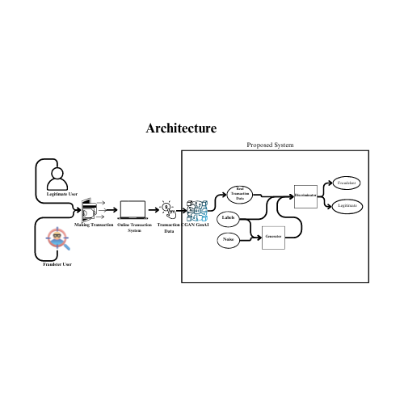

# Digital Payments Fraud Detection using CGANs
This Project is made for Silicon valley immersion program 2024
## Table of Contents
1. [Project Overview](#project-overview)
2. [Architecture](#architecture)
3. [Setup and Installation](#setup-and-installation)
4. [Usage](#usage)
5. [Results](#results)
6. [Contributing](#contributing)
7. [License](#license)
8. [Contact](#contact)

## Project Overview
A leading digital payments company processes millions of transactions daily across the globe. With the increasing volume and complexity of transactions, the company faces significant challenges in accurately detecting and preventing fraudulent activities.

This project aims to enhance current fraud detection mechanisms using **Conditional Generative Adversarial Networks (CGANs)** to accurately identify and prevent fraudulent transactions in real-time. Our approach focuses on:
- **Improving Data Quality and Diversity**: Enhancing the dataset to ensure robustness against biases.
- **Enhancing Anomaly Detection and Pattern Recognition**: Developing a model capable of recognizing complex fraud patterns.
- **Maintaining User Privacy and Data Security**: Ensuring compliance with privacy standards while improving detection capabilities.

## Architecture


The system architecture includes the following key components:
1. **Data Collection and Preprocessing**: Collecting and preprocessing transaction data to ensure quality and diversity.
2. **Model Training with CGANs**: Training CGANs to generate synthetic data that improves fraud detection capabilities.
3. **Real-Time Fraud Detection**: Using the trained discriminator to detect fraudulent transactions in real-time.

## Setup and Installation
### Prerequisites
- Python 3.8 or higher
- Jupyter Notebook
- Git

### Installation
1. Clone the repository:
   ```bash
   git clone https://github.com/Anu-S-M/GenAI-CGAN_Fraud_Detection.git
